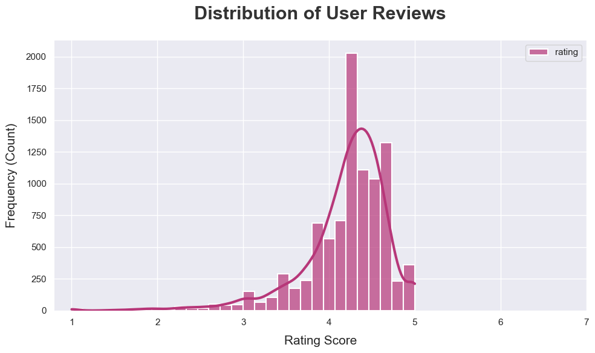
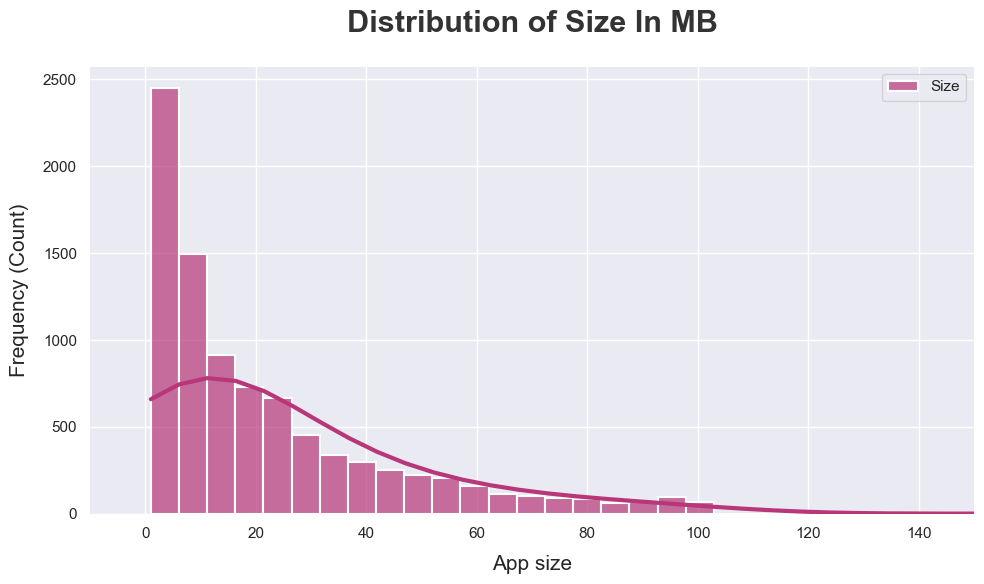
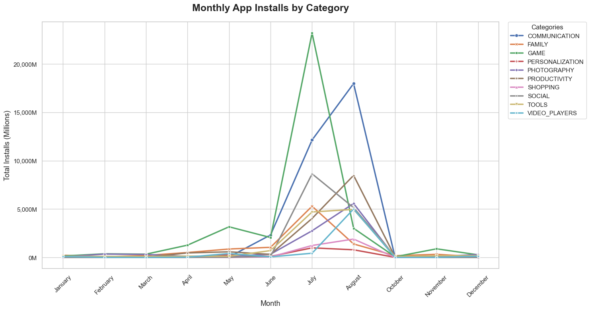
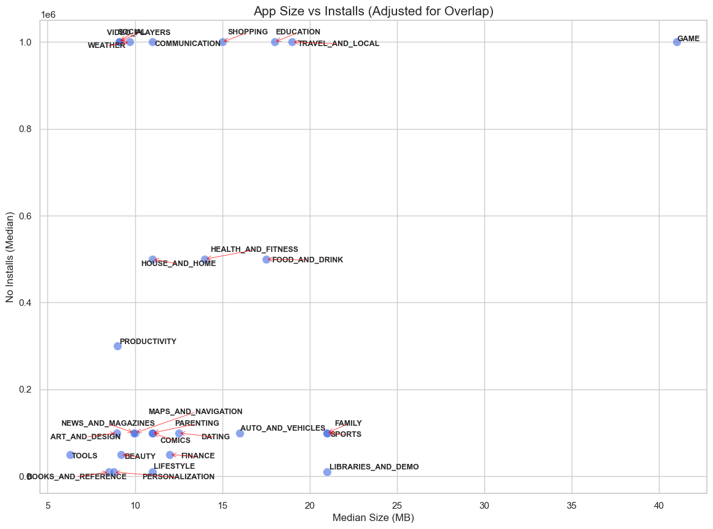

# Google Play Store Data Analysis

## Overview
This project shifts the focus on the mobile application ecosystem. By analyzing a comprehensive dataset of Google Play Store apps, I explore the factors that drive app success, including the relationship between app size, user ratings, and installation counts. The goal is to identify patterns that help developers and stakeholders understand market entry requirements and user expectations.

The data includes detailed attributes such as categories, ratings, reviews, size, and the number of installs, providing a rich landscape for both univariate and multivariate analysis.

# The Questions
Below are the key questions I addressed in this analysis:
1. What is the typical user rating distribution for apps on the Play Store?
2. How does the physical size of an app affect its distribution?
3. How have installation counts trended over time across different app categories?
4. Which categories are the most "optimal" (balancing high installs with manageable app sizes)?

# Tools I Used
- **Python:** The primary language used for data processing and analysis.
- **Pandas:** Crucial for data cleaning, such as converting string-based sizes (e.g., "M", "k") into uniform numeric Megabytes.
- **Matplotlib & Seaborn:** Used to create high-quality static visualizations.
- **Adjust_Text:** A specialized library used to automatically de-clutter labels in crowded scatter plots.
- **Jupyter Notebooks:** My environment for documenting code execution and insights.
- **SQL POSTGRE**
# Data Preparation and Cleanup
To ensure accurate plotting, the data required significant preprocessing, particularly for the `Size and Installs` columns which were originally stored as strings.The `released` column 
was also not in the correct format it was not in proper date time and also there were errors which I had resolved. `Price and reviews` is also to be converted into float.

## Numeric Conversion & Cleaning
I cleaned both the Installs and the size into float 
```python 
     
df['Installs']=df['Installs'].str.replace('+','')
df['Installs']=df['Installs'].str.replace(',','')
df2['Installs']=df2['Installs'].replace('Free',np.nan)
df2['Installs']=df2['Installs'].astype(float)

# for 'Size'
df['Size']=df['Size'].str.replace('M','')
df2['Size']=df2['Size'].replace('Varies with device',np.nan)
df2['Size']=df2['Size'].str.replace('k','')
df2['Size']=df2['Size'].str.replace('+','')
df2['Size']=df2['Size'].str.replace(',','')
df2['Size']=df2['Size'].astype(float)
# for reviews
df2['Reviews']=df2['Reviews'].str.replace('M','')
df2['Reviews']=df2['Reviews'].astype(float)
# for price
df2['Price']=df2['Price'].str.replace('$','')
df2['Price']=df2['Price'].replace('Everyone',np.nan)
df2['Price']=df2['Price'].astype(float)

```
## Date time conversion

```python


df['Released'] = df['Released'].str.replace('Aughust','August')
df['Released']=pd.to_datetime(df['Released'],format='%B %d, %Y',errors='coerce')


```
# The Analysis
Analysing for applications data is going to help for the success of an application.

## 1. What is the typical user rating distribution for apps on the Play Store?

To find this I analysed the distribution of the rating using a histogram.

View my notebook with detailed steps here: [univariate](1_univariate_analysis.ipynb).

### Visualize Data
``` python
query3="""  
SELECT
    rating
FROM 
     apps_data
WHERE
     rating <= '5'    
"""

df2=pd.read_sql(query3,engine)
sns.set_theme(style="darkgrid") 

plt.figure(figsize=(10, 6))
ax = sns.histplot(
    data=df2, 
    bins=30, 
    kde=True, 
    palette='magma',
    alpha=0.7,
    edgecolor='white',
    linewidth=1.5,
    line_kws={'linewidth': 3, 'color': '#ff4b2b'}
)

plt.title('Distribution of User Reviews', fontsize=22, pad=25, fontweight='bold', color='#333333')
plt.xlabel('Rating Score', fontsize=15, labelpad=10)
plt.ylabel('Frequency (Count)', fontsize=15, labelpad=10)

plt.xlim(None, 7)
sns.despine(left=True, bottom=True)
plt.tight_layout()

plt.show()
  

```

### Results
 

 ### Insights
 The mean is less than the median value so the data is left skewed
 meaning there are some very less value that is pulling the data back

## 2.How does the physical size of an app affect its distribution?

To find this I analysed the distribution of the size using a histogram.

View my notebook with detailed steps here: [univariate](1_univariate.ipynb).

### Visualize Data
``` python
query3="""  
  SELECT
     "Size"
  FROM
     apps_data
"""

df4=pd.read_sql(query3,engine)
sns.set_theme(style="darkgrid") 

plt.figure(figsize=(10, 6))
ax = sns.histplot(
    data=df4, 
    bins=200, 
    kde=True, 
    palette='magma',
    alpha=0.7,
    edgecolor='white',
    linewidth=1.5,
    line_kws={'linewidth': 3, 'color': '#ff4b2b'}
)

plt.title('Distribution of Size In MB', fontsize=22, pad=25, fontweight='bold', color='#333333')
plt.xlabel('App size', fontsize=15, labelpad=10)
plt.ylabel('Frequency (Count)', fontsize=15, labelpad=10)

plt.xlim(-10, 150)
sns.despine(left=True, bottom=True)
plt.tight_layout()

plt.show()
  

```

### Results
 

 ### Insights
AS the size in MB goes on increasing the there are less number of apps so we can say that 
application with large size are not something that is in high number. The distribution is right skewed. Developers tend to keep the applications light weight posibly due storage constraits , performance for the user.


## 3. How have installation counts trended over time across different app categories?

To find this I analysed the distribution of the size using a timeseries plot.

View my notebook with detailed steps here: [byvariate](2_byvariate_analysis.ipynb).

### Visualize Data
``` python
query4="""
     SELECT
      DISTINCT
       category,TO_CHAR(released,'Month') AS "month_name",EXTRACT('MONTH' FROM released) AS "month_no",SUM(installs) OVER(PARTITION BY category,TO_CHAR(released,'Month') )
    FROM 
      apps_data
    WHERE category IN ('GAME',
                  'COMMUNICATION',
                     'SOCIAL',
                     'FAMILY',
                      'TOOLS',
                   'PHOTOGRAPHY',
                   'SHOPPING',
                  'PRODUCTIVITY',
                   'VIDEO_PLAYERS',
                  'PERSONALIZATION')

  ORDER BY 
        category,month_no
  """
df4=pd.read_sql(query4,engine)
  
pivot_table=df4.pivot_table(index='month_name',columns='category',values='sum')


  
import matplotlib.ticker as ticker


def millions_formatter(x, pos):
    return f'{x*1e-6:,.0f}M'

plt.figure(figsize=(15, 8))
sns.set_theme(style="whitegrid")

sns.lineplot(data=pivot_table, markers=True, dashes=False, linewidth=2.5)

olt.gca().yaxis.set_major_formatter(ticker.FuncFormatter(millions_formatter))

plt.title('Monthly App Installs by Category', fontsize=18, fontweight='bold', pad=20)
plt.xlabel('Month', fontsize=13)
plt.ylabel('Total Installs (Millions)', fontsize=13)
plt.xticks(rotation=45)
plt.legend(title='Categories', loc='upper left')

plt.tight_layout()
plt.show()

```

### Results
 

 ### Insights
There is a clear seasonal spike in installs during mid-year, suggesting increased user activity or major app releases during this period. Major spike can be seen in July-August
for Game, Communication, social


## 4. Which categories are the most "optimal" (balancing high installs with manageable app sizes)?

To find this I analysed the distribution of the size using a scatter plot.

View my notebook with detailed steps here: [optimum](4_optimum_size_install.ipynb).

### Visualize Data
``` python
query2="""  
   WITH table1 AS(  SELECT
       category,PERCENTILE_CONT(0.5) WITHIN GROUP (ORDER BY "Size") AS median_size ,PERCENTILE_CONT(0.5) WITHIN GROUP (ORDER BY installs) AS median_install
      FROM
       apps_data
      WHERE 
            category!='1.9'  
      GROUP BY 
            category
      ORDER BY
          PERCENTILE_CONT(0.5) WITHIN GROUP (ORDER BY installs)  DESC 
       LIMIT 30)
       SELECT
         *
       FROM 
       table1
       WHERE 
          median_install<5000000
       ; 
            
       """

df2=pd.read_sql(query2,engine)

from adjustText import adjust_text
trending_cat=df2['category'].values
sns.set_theme(style="whitegrid")
plt.figure(figsize=(14, 10))

sns.scatterplot(data=df2, x='median_size', y='median_install', s=100, color='royalblue', alpha=0.6)

trending_cat = df2['category'].values

texts = []
for i in range(len(df2)):
    texts.append(plt.text(
        x=df2['median_size'].iloc[i], 
        y=df2['median_install'].iloc[i], 
        s=trending_cat[i], 
        fontsize=9,
        fontweight='semibold'
    ))

adjust_text(
    texts, 
    arrowprops=dict(arrowstyle='->', color='red', lw=0.5),
    expand_points=(2, 2),
    expand_text=(1.5, 1.5),
    force_text=(0.5, 1.0),
    only_move={'points':'y', 'text':'xy'}
)

plt.xlabel('Median Size (MB)', fontsize=12)
plt.ylabel('No Installs (Median)', fontsize=12)
plt.title('App Size vs Installs (Adjusted for Overlap)', fontsize=15)
plt.show()


```

### Results
 

 ### Insights
There is no direct relation ship between app size and the no of installs can be seen 
but it can be said that most of the applications catrgories have similar app size and installs they are packed together but one category of app such as game as high size but the no of installs are also quite more.